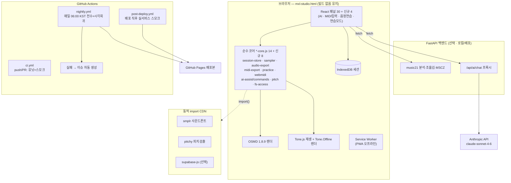

> **스냅샷 주의 (2026-09-03)**
> 이 문서는 다른 스냅샷(패널 30개·코어 14개) 기준입니다. Studio09에는 다음 파일이 없습니다: `fingering-core.js`, `voice-leading-core.js`, `export-formats-core.js`, `ear-training-core.js`, `pattern-search-core.js`, `layout-core.js`, `annotations-core.js`, `form-analysis-core.js`, `lyrics-core.js`, `difficulty-core.js`.
> 이 폴더에서는 `MXL-Studio09-개선보완-바이브코딩-프롬프트(Fable51).md`의 Phase 0-8 구현을 기준으로 사용하세요. 이 문서의 Phase 2-7은 선택 Phase 9 지침에 따라 현재 소스에 맞게 재조정해야 합니다. 아래 내용은 과거 설계 기록이며 현재 구현 목록이 아닙니다.

# 악보 디자이너(MXL Studio) — 차세대 기능 확장 & 주기 자동 테스트 바이브코딩 프롬프트

> 대상 앱: https://kimyounggaur.github.io/Score_Designer-Original-/mxl-studio.html
> 저장소: `kimyounggaur/Score_Designer-Original-`
> 작성일: 2026-07-06
> 사용법: 각 Phase의 "📋 붙여넣기 프롬프트" 블록을 그대로 AI 코딩 도구(Claude Code 등)에 붙여넣고, **수용 기준을 전부 통과한 뒤에만** 다음 단계로 넘어가세요.

---

# Part 0. 현재 앱 심층 분석 (프롬프트 작성의 근거)

## 0.1 아키텍처 스냅샷

| 항목 | 현재 상태 |
|---|---|
| 메인 파일 | `mxl-studio.html` **6,396줄 / 약 341KB** — 단일 HTML 안에 React 앱 전체 |
| 프레임워크 | React 18.2 UMD + **Babel Standalone 7.23.9 (브라우저 런타임 JSX 컴파일, 빌드 없음)** |
| 스타일 | `styles.css` 3,232줄 — "React에는 로직만, 스타일은 CSS만" 설계 계약 (HTML 주석에 명시됨) |
| 코어 모듈 | 14개 `*-core.js` — 전부 `(function(global){...})(window)` UMD 패턴, `window.XxxCore` 네임스페이스 |
| 기존 테스트 | 12개 `*-core.test.html` — 브라우저에서 수동으로 열어 `PASS`/`FAIL` 확인하는 assert 패턴 |
| 렌더링 | OpenSheetMusicDisplay(OSMD) 1.8.9 (SVG backend) |
| 재생 | Tone.js 14.8.49 — `PolySynth` 기반 3종 근사 음색(piano/strings/flute), 오실레이터 합성 |
| 압축/파일 | JSZip 3.10.1 (MXL 압축 해제), QRCode.js 1.0.0 (공유 QR) |
| 백엔드(선택) | `api_key_analysis.py` — FastAPI + music21. `/api/analyze-key`, `/api/analyze-harmony`, `/api/transpose`, `/api/convert-mscz`(MuseScore CLI 추정). 기본 주소 `http://127.0.0.1:8000`, CORS `*` |
| 배포 | GitHub Actions → GitHub Pages (push 시 전체 폴더 그대로 업로드). `vercel.json`도 존재 |
| 패키지 관리 | **package.json 없음** — npm 의존성 0개, 전부 CDN |

## 0.2 기능 인벤토리 — 30개 패널

**왼쪽 액티비티 바 (변환 도구 11개):**
`upload`(파일 업로드) · `transpose`(조옮김) · `keychange`(마디별 조바꿈) · `capo`(카포) · `layout`(레이아웃 편집) · `range`(음역대 조정) · `instrument`(이조 악기 44종) · `tempo`(템포 조절) · `tempochange`(마디별 템포) · `ossia`(Ossia 마디) · `clef`(음자리표 변환)

**오른쪽 액티비티 바 (분석/교육 도구 19개):**
`parts`(파트 추출) · `notation`(악보 표기 변환) · `lyrics`(가사 편집) · `export`(이미지/PDF/ABC/LilyPond/SVG) · `color`(색깔 악보) · `harmony`(화성 쌓기) · `chordtools`(코드 도구) · `numbering`(숫자 악보) · `lyricstyle`(가사 스타일) · `roman`(로마 숫자 분석) · `fingering`(운지법 — 리코더/칼림바 SVG) · `eartraining`(청음 훈련) · `chords`(코드 분석) · `voiceleading`(성부 진행 분석) · `patternsearch`(음형 패턴 검색) · `annotations`(주석 메모 오버레이) · `formanalysis`(형식 분석) · `difficulty`(난이도 레이더) · `stats`(통계 분석)

**패널 외 시스템 기능:**
- 파일 입력: `.mxl`(JSZip 해제 + container.xml rootfile 탐색) / `.xml` / `.musicxml` / `.mscz`(백엔드 변환)
- 히스토리: undo/redo, 최대 50개, **xmlDoc `cloneNode(true)` 딥클론 스냅샷**, `Ctrl+Z`/`Ctrl+Y` 단축키
- 세션: 5초 디바운스 localStorage 자동저장, 이름 있는 슬롯(`prompt()` 사용), JSON 내보내기/가져오기, 재방문 시 복원 배너
- 공유: XML → base64 → **URL fragment**(`#`) 인코딩, 경고 200KB / 상한 500KB, QR 코드
- 내보내기: XML(MXL 버튼), PNG(SVG→canvas 2배율), PDF(새 창 `window.print()`), ABC/LilyPond/SVG(`ExportFormatsCore`)
- 재생: MusicXML → 이벤트 추출(`extractMidiPlaybackData`) → Tone.js 스케줄링, 커서 트랜스포트 바, 마디 하이라이트

## 0.3 코어 모듈 14개 (테스트 이식 대상)

| 모듈 | 네임스페이스 | 역할 | 기존 test.html |
|---|---|---|---|
| chord-tools-core.js | `ChordToolsCore` | N.C. 판정, 코드 채우기 보조 | ✅ |
| history-core.js | `GlobalHistoryCore`* | 히스토리 push/restore/50개 컷/메타 직렬화 | ✅ |
| fingering-core.js | `FingeringCore` | 리코더/칼림바 운지 테이블 | ✅ |
| voice-leading-core.js | `VoiceLeadingCore` | 병행 5/8도 등 성부 진행 검출 | ✅ |
| export-formats-core.js | `ExportFormatsCore` | ABC · LilyPond 변환, SVG 직렬화 | ✅ |
| ear-training-core.js | `EarTrainingCore` | 음정/화음 퀴즈 생성·채점 | ✅ |
| pattern-search-core.js | `PatternSearchCore` | 계이름/리듬 패턴 파싱·검색 | ✅ |
| layout-core.js | `LayoutCore` | 페이지/여백/시스템 브레이크 XML 반영 | ✅ |
| share-session-core.js | `ShareSessionCore` | 세션 직렬화, 공유 URL 인코딩/파싱 | ✅ |
| annotations-core.js | `AnnotationsCore` | 주석 CRUD 모델 | ✅ |
| form-analysis-core.js | `FormAnalysisCore` | 마디 유사도 → A/B 형식 라벨링 | ✅ |
| lyrics-core.js | `LyricsCore` | 가사 추출/일괄 배치(한글 음절 처리) | ✅ |
| difficulty-core.js | `DifficultyCore` | 7지표 가중 난이도 산출 | ✅ |
| roman-analysis-core.js | `RomanAnalysisCore` | 로마숫자 화성 분석·삽입 | ❌ (test.html 없음) |

\* 주의: 파일 내부 노출 이름과 `mxl-studio.html`에서 부르는 이름(`GlobalHistoryCore`)이 다를 수 있음 — 실제 코드에서 `window.` 뒤 식별자를 grep으로 재확인 후 테스트 작성.

## 0.4 강점 vs 한계 → 확장 기회 매핑

| # | 한계 (현재) | 최신 기술 해법 | Phase |
|---|---|---|---|
| 1 | localStorage 세션(≈5MB 한계) + 히스토리 딥클론 메모리 부담 | **IndexedDB** + 문자열 스냅샷 | 1.1 |
| 2 | 공유 URL 500KB 상한 → 큰 악보 공유 불가 | **CompressionStream API**(gzip) 압축 공유 v2 | 1.2 |
| 3 | 오실레이터 합성음 → 피아노답지 않은 소리 | **사운드폰트 샘플러(smplr)** 동적 import | 2.1 |
| 4 | 오디오 파일로 못 뽑음 (귀로만 확인) | **Tone.Offline → WAV / lamejs MP3** 내보내기 | 2.2 |
| 5 | .mid 내보내기 없음 (DAW 연계 불가) | **순수 JS SMF 라이터** (코어 모듈, 테스트 가능) | 2.3 |
| 6 | 연습 지원 도구 부족 | A–B 루프 + 메트로놈 + 속도 트레이너 | 2.4 |
| 7 | 하드웨어 입력 불가 | **Web MIDI API** (건반 입력, 청음 응답) | 3 |
| 8 | AI 부재 — 이론 질문/자연어 편집 불가 | **Claude API** 프록시 + 커맨드 실행기 | 4 |
| 9 | 연주 피드백 없음 | **Web Audio 피치 검출(pitchy)** 음정 연습 | 5 |
| 10 | 설치/오프라인 불가, 다운로드 폴더로만 저장 | **PWA + File System Access API** | 6 |
| 11 | 공유가 URL에 갇힘 | **Supabase** 클라우드 공유(선택) | 7 |
| 12 | **테스트가 전부 수동**(브라우저에서 test.html 열기), CI에 테스트 0개 | **Vitest + Playwright + GitHub Actions cron** 주기 자동 테스트 | **8** |

## 0.5 발견된 리스크 (프롬프트에 반영됨)

- `api_key_analysis.py`의 CORS가 `allow_origins=["*"]` — AI 프록시 추가 시 반드시 화이트리스트로 전환 (Phase 4.1).
- 세션 슬롯 저장이 `window.prompt()` 사용 → Playwright E2E에서 dialog 핸들러 필수 (Phase 8 함정 목록).
- 히스토리 50개 × 다중 파일 딥클론 → 대형 악보에서 메모리 급증 가능 (Phase 1.1에서 개선).
- 파일명이 `api_key_analysis.py`이지만 실제로는 "조성(key) 분석" 서버 — 오해 방지를 위해 Phase 4.1에서 `server/main.py`로 개명 포함.

---

# Part 1. 바이브코딩 공통 규칙 (모든 프롬프트에 자동 적용되는 계약)

아래 블록을 **매 세션 시작 시 1회** 붙여넣거나, Claude Code 사용 시 프로젝트 루트에 `CLAUDE.md`로 저장하세요.

````text
[프로젝트 계약 — 모든 작업에 적용]

너는 지금부터 "악보 디자이너(MXL Studio)" 저장소에서 작업한다. 반드시 지켜야 할 규칙:

1. 아키텍처 보존
   - 이 앱은 빌드 스텝이 없는 단일 HTML(React 18 UMD + Babel Standalone) 앱이다.
     Vite/Webpack 마이그레이션을 임의로 제안하거나 수행하지 마라.
   - 새 로직은 반드시 두 층으로 분리한다:
     (a) 순수 로직 → 새 `*-core.js` 파일. `(function(global){ ... global.XxxCore = {...}; })(window);`
         UMD 패턴을 그대로 따르고, DOM 이벤트/React를 절대 참조하지 않는다.
     (b) UI → `mxl-studio.html` 안의 React 패널 컴포넌트. 기존 패널(예: TransposePanel)의
         props 계약 `{files, activeFile, showProgress, hideProgress, onFilesUpdate}`를 그대로 따른다.
   - 스타일은 styles.css에만 추가한다. 인라인 스타일/스타일 라이브러리 금지.
     동적 값이 필요하면 CSS Custom Property(--변수)로 전달한다.

2. 상태/데이터 규칙
   - 파일 객체 형태는 {name, xmlDoc(Document), xmlString, sourceName}이다. 이 구조를 깨지 마라.
   - 악보를 변경하는 모든 작업은 xmlDoc을 복제(cloneDoc) 후 수정하고,
     onFilesUpdate(newFiles, '한글 작업 라벨')로 커밋해서 히스토리에 자동 기록되게 한다.
   - 외부 라이브러리가 꼭 필요하면: (1) cdnjs/unpkg에서 버전 고정 URL로,
     (2) <script type="text/babel"> 안에서는 정적 import 불가이므로 동적 import('https://...') 사용,
     (3) 로드 실패 시 기존 동작으로 폴백하는 try/catch를 반드시 넣는다.

3. 진행 방식
   - 한 번에 한 기능만. 코드를 쓰기 전에 (a) 수정/생성할 파일 목록 (b) 새 함수 시그니처를
     먼저 요약해 보여주고 승인받아라.
   - 새 *-core.js를 만들면 같은 커밋에 대응하는 Vitest 테스트 파일(tests/unit/*.test.js)을
     반드시 함께 만든다. (Phase 8 완료 전이라면 기존 관례대로 *-core.test.html을 만든다.)
   - 기존 함수 시그니처를 바꾸지 마라. 필요하면 새 함수를 추가하고 기존 것은 위임(delegate)시켜라.
   - 모든 사용자 노출 문구는 한국어로 쓴다.

4. 검증
   - 작업 후 반드시: 로컬 서버(npx http-server . -p 8080)로 mxl-studio.html을 열어
     콘솔 에러 0개인지, 대표 시나리오(파일 업로드 → 해당 패널 조작 → 악보 갱신 확인)가 되는지
     스스로 점검한 결과를 보고하라.
   - Phase 8 구축 이후에는 `npm test`(Vitest)와 `npm run e2e:smoke`가 전부 초록인지 보고하라.
````

**Phase 진행 순서(권장 로드맵):** 회귀 사고를 막으려면 **Phase 8(자동 테스트)을 가장 먼저 구축**하고 → 1 → 2 → 3 → 4 → 5 → 6 → 7 순서로 기능을 얹는 것이 안전합니다. 기능이 급하면 1·2를 먼저 하되, Phase 8 이전에는 각 기능의 `*-core.test.html`을 기존 관례대로 만들어 두었다가 8.1에서 일괄 이식하세요.

---

# Part 2. 기능 확장 Phase 1–7

---

## Phase 1 — 저장·공유 기반 현대화

### 1.1 IndexedDB 세션 저장소 (localStorage 5MB 한계 돌파)

**목표:** 세션 자동저장·슬롯을 localStorage → IndexedDB로 이전. 대형 악보(수 MB) 여러 개도 저장 가능하게. 기존 localStorage 데이터는 최초 1회 자동 마이그레이션.

📋 **붙여넣기 프롬프트**

````text
[Phase 1.1 — IndexedDB 세션 저장소]

새 파일 `session-store-core.js`를 만들어라. 외부 라이브러리 없이 순수 IndexedDB로 구현한다.

요구 스펙:
1. DB 이름 'mxl-studio', 버전 1, 오브젝트 스토어 2개:
   - 'sessions' (keyPath: 'id')  ← 자동저장은 id='autosave' 고정, 슬롯은 'slot-{timestamp}'
   - 'meta' (keyPath: 'key')
2. 노출 API (전부 Promise 반환, window.SessionStoreCore):
   - openDb(), saveSession(session), loadSession(id), listSessions(), deleteSession(id)
   - migrateFromLocalStorage(): ShareSessionCore.SESSION_KEY / SLOT_KEY에 남아있는
     기존 localStorage 데이터를 읽어 IndexedDB로 옮기고, 성공 시 localStorage 원본을 지운 뒤
     'meta'에 {key:'migratedAt', value:ISO문자열}을 기록한다. 이미 migratedAt이 있으면 no-op.
   - estimateUsage(): navigator.storage.estimate() 래핑 (미지원 브라우저는 null 반환)
3. 저장 직전에 session 객체 안의 files[i].xml 문자열을 그대로 두되,
   전체 JSON 크기가 4MB를 넘으면 saveSession이 {ok:false, reason:'too-large', size} 를
   던지지 말고 반환하게 하라(호출부가 사용자에게 안내).
4. IndexedDB 실패(프라이빗 모드 등) 시 모든 함수가 조용히 localStorage 폴백을 쓰도록
   내부 어댑터를 두어라. 폴백 여부는 SessionStoreCore.backend() → 'idb' | 'local' 로 확인 가능.

mxl-studio.html 수정:
5. <head>의 코어 스크립트 목록에 session-store-core.js?v=1 추가.
6. App() 안의 세 지점을 교체한다 — (a) 5초 디바운스 자동저장 useEffect,
   (b) saveSessionSlot, (c) 부팅 시 세션/슬롯 로딩 useEffect.
   전부 await SessionStoreCore.* 호출로 바꾸되, 함수 시그니처와 UI 흐름(복원 배너,
   SessionMenu)은 그대로 유지한다. 부팅 useEffect 최상단에서 migrateFromLocalStorage()를
   1회 호출한다.
7. SessionMenu 하단에 작은 회색 텍스트로 저장 용량 표시:
   "저장소: {usage}/{quota} (IndexedDB)" — estimateUsage() 결과, null이면 숨김.

테스트(같은 커밋에 포함):
8. Phase 8이 이미 구축되어 있으면 tests/unit/session-store-core.test.js를 만들고
   fake-indexeddb 패키지로 saveSession→loadSession 라운드트립, 4MB 초과 거부,
   migrateFromLocalStorage 1회성, listSessions 정렬을 검증하라.
   Phase 8 이전이면 session-store-core.test.html을 기존 패턴으로 만들어라.
````

**✅ 수용 기준**
- 새로고침 후 "이전 세션 복원" 배너가 기존과 동일하게 동작 (데이터 출처만 IndexedDB).
- DevTools → Application → IndexedDB에 `mxl-studio/sessions` 레코드 생성 확인.
- 기존에 localStorage 세션이 있던 브라우저에서 최초 1회 자동 이관 + 원본 삭제.
- 6MB짜리 다중 파일 세션도 슬롯 저장 성공 (localStorage였다면 QuotaExceededError였을 크기).
- 콘솔 에러 0.

**⚠️ 함정:** IndexedDB API는 콜백 기반이므로 반드시 Promise 래핑. Safari 프라이빗 모드에서 open이 실패할 수 있어 폴백 경로가 실제로 실행되는지 확인.

---

### 1.2 CompressionStream 압축 공유 링크 v2 (500KB 상한 해소)

**목표:** 공유 URL을 `gzip → base64url`로 압축해 같은 악보 기준 링크 길이를 대략 1/4~1/8로. 구버전 링크도 계속 열리게 하위호환 유지.

📋 **붙여넣기 프롬프트**

````text
[Phase 1.2 — CompressionStream 압축 공유 v2]

share-session-core.js를 확장한다. 기존 함수는 절대 삭제/변경하지 말고 추가만 하라.

1. 유틸 추가 (전부 ShareSessionCore에 노출):
   - supportsCompression(): typeof CompressionStream !== 'undefined'
   - gzipToBase64Url(text): TextEncoder → CompressionStream('gzip') → 결과 바이트를
     base64url(+→-, /→_, = 제거)로. async.
   - gunzipFromBase64Url(b64): 역방향. async.
2. buildShareURLv2(file): 페이로드를 `v2.` 접두사 + gzip base64url 로 만들어
   기존과 동일하게 URL fragment(#)에 싣는다. CompressionStream 미지원 브라우저면
   기존 v1 인코더로 자동 폴백한다.
3. parseShareURL을 async 버전 parseShareURLAny(href)로 감싼다:
   fragment가 'v2.'로 시작하면 gunzip 경로, 아니면 기존 parseShareURL 호출.
   mxl-studio.html의 부팅 useEffect에서 parseShareURL 호출부를 parseShareURLAny로 교체
   (async이므로 즉시실행 async 함수로 감싼다).
4. 크기 정책 갱신: 압축 후 크기 기준으로 경고 200KB/상한 500KB를 판정하고,
   ShareModal에 "원본 {x}KB → 압축 {y}KB ({z}% 절감)" 한 줄을 표시한다.
5. QR 코드는 압축 후에도 2KB를 넘으면 기존처럼 "QR로는 너무 큽니다" 안내 유지.

테스트:
6. tests/unit/share-v2.test.js (또는 test.html): 한글 가사 포함 XML 문자열을
   gzip→base64url→gunzip 라운드트립했을 때 원문과 완전 일치,
   'v2.' 접두사 분기, v1 링크 하위호환(기존 인코더 산출물을 parseShareURLAny로 파싱)을 검증.
   Node 20+에는 CompressionStream이 전역으로 있으므로 브라우저 없이 테스트 가능하다.
````

**✅ 수용 기준**
- 기존에 "500KB 초과" 경고가 뜨던 악보가 v2로는 공유 링크 생성 성공.
- v1 형식 링크(업데이트 전에 만든 링크)를 열어도 정상 로드.
- ShareModal에 절감률 표시. Safari 16.4 미만 시뮬레이션(supportsCompression을 false로 강제)에서 v1 폴백 동작.

---

## Phase 2 — 사운드 & 재생 업그레이드

### 2.1 사운드폰트 샘플러 재생 (진짜 피아노 소리)

**목표:** Tone.js 오실레이터 합성 대신 실제 샘플 기반 음색. 라이브러리는 **smplr**(ESM, 동적 import) 사용, 로드 실패 시 기존 신스로 폴백.

📋 **붙여넣기 프롬프트**

````text
[Phase 2.1 — smplr 사운드폰트 재생]

mxl-studio.html의 createMidiSynth / MidiPlayer를 확장한다.

1. 새 코어 파일 sampler-core.js:
   - window.SamplerCore.loadSampler(instrumentId, audioContext) 를 구현.
     내부에서 const smplr = await import('https://unpkg.com/smplr/dist/index.mjs') 를
     1회만 수행해 모듈 캐시(let smplrModule)에 보관한다. (unpkg 최신 안정 버전을 확인해
     @버전 고정 URL로 박아라.)
   - instrumentId 매핑: 'piano-sf' → new smplr.SplendidGrandPiano(ctx),
     'strings-sf' → new smplr.Soundfont(ctx,{instrument:'string_ensemble_1'}),
     'flute-sf' → new smplr.Soundfont(ctx,{instrument:'flute'}).
   - 반환 형태를 기존 createMidiSynth 반환과 호환되게 어댑터로 감싼다:
     {triggerAttackRelease(noteName, durSec, time, velocity), dispose()}.
     smplr의 start({note, time, duration, velocity})로 위임한다.
   - 로드/네트워크 실패 시 null을 반환하고 콘솔 warn 1줄만 남긴다.
2. MidiPlayer 수정:
   - 악기 셀렉트에 3개 옵션 추가: "🎹 피아노(고음질)", "🎻 스트링(고음질)", "🪈 플루트(고음질)".
   - 고음질 선택 시: 재생 시작 직전 showProgress('음원 로딩 중...')를 띄우고
     SamplerCore.loadSampler를 await. null이면 alert 대신 로그 패널에
     "고음질 음원 로드 실패 — 기본 음색으로 재생합니다"를 남기고 기존 신스로 폴백.
   - Tone.Transport 스케줄 콜백에서 synth.triggerAttackRelease 호출부는 어댑터 덕에
     분기 없이 동일해야 한다. AudioContext는 Tone.getContext().rawContext를 넘겨
     두 시스템이 같은 컨텍스트/클록을 쓰게 하라.
   - 샘플러 인스턴스는 악기 변경/언마운트 시 dispose.
3. 최초 사용자 제스처(재생 버튼 클릭) 전에 어떤 오디오 객체도 만들지 마라
   (autoplay 정책). 기존 Tone.start() 위치를 그대로 활용.

수동 검증 절차를 실행 후 보고: 업로드 → 고음질 피아노 선택 → 재생 → 소리가
피아노 샘플로 들리는지(개발자는 파형 대신 콘솔의 로드 성공 로그 + Transport state로 판단),
네트워크 오프라인 강제 후 폴백 재생 확인.
````

**✅ 수용 기준**
- 고음질 3종 재생 성공, 커서/마디 하이라이트 등 기존 트랜스포트 UI 이상 없음.
- 오프라인/차단 상태에서 자동 폴백 + 로그 안내.
- 기본(합성) 3종 음색은 완전히 기존과 동일하게 유지.

**⚠️ 함정:** `<script type="text/babel">` 안에서는 정적 `import` 문이 불가 — 반드시 동적 `import()`. smplr 샘플은 CDN에서 받아오므로 첫 재생만 수 초 지연될 수 있음(로딩 오버레이 필수).

---

### 2.2 오디오 내보내기 — WAV / MP3

**목표:** 현재 재생 데이터를 `Tone.Offline`으로 무음 고속 렌더링 → WAV(무손실) 및 MP3(lamejs) 파일 다운로드.

📋 **붙여넣기 프롬프트**

````text
[Phase 2.2 — WAV/MP3 오디오 내보내기]

1. 새 코어 파일 audio-export-core.js (window.AudioExportCore):
   - audioBufferToWavBlob(audioBuffer): 44.1kHz 16bit PCM RIFF/WAVE 인코더를
     순수 JS로 구현(스테레오 인터리브, 리틀엔디언). 외부 라이브러리 금지.
   - float32ToInt16(float32Array): 클리핑 포함 변환 유틸(테스트 대상).
   - audioBufferToMp3Blob(audioBuffer, kbps=192): window.lamejs 전제.
     lamejs.Mp3Encoder(channels, sampleRate, kbps)로 1152 샘플 블록 인코딩.
2. <head>에 cdnjs lamejs 1.2.1 스크립트 태그 추가 (버전 고정).
3. ExportPanel에 "오디오" 섹션 추가:
   - 포맷 라디오: WAV / MP3(192kbps), 악기 셀렉트(2.1과 동일 목록), [오디오 생성] 버튼.
   - 클릭 시: extractMidiPlaybackData로 이벤트/총길이 계산 →
     Tone.Offline(async ({transport}) => { 기존 스케줄링 로직 재사용 }, totalSec + 1.5)
     로 AudioBuffer 렌더 → 선택 포맷 Blob → downloadBlob(blob, '{곡명}.wav|mp3').
   - 렌더 중 showProgress('오디오 렌더링 중... {n}%') — Tone.Offline은 진행률 콜백이
     없으므로 총길이 기반 가짜 진행률(경과시간/예상시간)로 표시하고 완료 시 100%.
   - 3분 초과 곡은 "긴 곡은 렌더에 수십 초가 걸릴 수 있습니다" 사전 confirm.
4. 스케줄링 로직 재사용을 위해 MidiPlayer 안의 스케줄 함수를
   scheduleEventsOnTransport(transport, synthAdapter, events) 형태의 컴포넌트 밖
   순수 함수로 추출하고, 실시간 재생과 오프라인 렌더가 이 함수를 공유하게 리팩터링하라.
   (기존 실시간 재생 동작이 1도 달라지면 안 된다.)

테스트:
5. tests/unit/audio-export-core.test.js: float32ToInt16 경계값(±1.0, 0, 클리핑 >1),
   WAV Blob 헤더 바이트 검증(RIFF, WAVE, fmt 청크, 데이터 길이 필드 일치) —
   AudioBuffer 목킹은 {numberOfChannels, sampleRate, length, getChannelData} 만 흉내내면 된다.
````

**✅ 수용 기준**
- 4마디 테스트 악보 → WAV 다운로드 → 미디어 플레이어에서 정상 재생, 길이 오차 ±0.2초 이내.
- MP3도 동일. 렌더 중 UI 조작 잠금(오버레이) 후 정상 복귀.
- 실시간 재생 회귀 없음(리팩터링 검증).

---

### 2.3 표준 MIDI 파일(.mid) 내보내기

**목표:** DAW/MuseScore와 주고받을 수 있는 SMF 파일 생성. 외부 의존성 없는 순수 코어 모듈이라 **유닛 테스트로 바이트 단위 검증 가능**.

📋 **붙여넣기 프롬프트**

````text
[Phase 2.3 — SMF(.mid) 내보내기 코어]

1. 새 파일 midi-export-core.js (window.MidiExportCore). 순수 함수만:
   - varLen(n): SMF 가변 길이 수량 인코딩 → Uint8Array (테스트 필수).
   - buildMidiFile({tracks, bpm, division=480}):
     * 헤더 청크 MThd: format 1, ntrks = tracks.length + 1(템포 트랙), division.
     * 트랙 0: set-tempo 메타(FF 51 03, 마이크로초/분음표 = round(60000000/bpm)) + EOT.
     * 각 파트 트랙: program change(악기 general MIDI 번호, 기본 0=피아노),
       note-on(0x90)/note-off(0x80) 델타타임 이벤트, 채널 = trackIndex % 16 (9번 건너뜀),
       velocity 기본 96, 마지막에 EOT(FF 2F 00).
     * 반환: Uint8Array.
   - eventsFromPlaybackData(playbackEvents, division, bpm):
     mxl-studio.html의 extractMidiPlaybackData가 만드는
     {timeSec, durSec, midi, partIndex} 배열을 틱 기반 트랙별 정렬 이벤트로 변환.
     tick = round(timeSec * bpm/60 * division). 동시 발음 안정 정렬(틱→off우선→노트번호).
2. mxl-studio.html:
   - ExportPanel 텍스트 포맷 셀렉트(abc/lilypond) 옆에 [MIDI 파일(.mid)] 버튼 추가.
   - 클릭 → extractMidiPlaybackData(현재 파일, 현재 BPM) → 코어 호출 →
     downloadBlob(new Blob([bytes],{type:'audio/midi'}), '{곡명}.mid').
   - <head>에 midi-export-core.js?v=1 추가.

테스트 (핵심 — 반드시 포함):
3. tests/unit/midi-export-core.test.js:
   - varLen: 0→[0x00], 127→[0x7F], 128→[0x81,0x00], 480→[0x83,0x60], 0x0FFFFFFF 경계.
   - buildMidiFile 산출 바이트: 'MThd' 매직, 길이 6, format 1, division 480,
     템포 메타가 120bpm일 때 0x07 0xA1 0x20 인지, 트랙마다 EOT로 끝나는지.
   - eventsFromPlaybackData: C4 1박(60bpm, div480) → note-on tick 0, note-off tick 480.
````

**✅ 수용 기준**
- 내보낸 .mid를 MuseScore로 열었을 때 음높이·리듬·파트 수가 원본과 일치(사람 검수 1회).
- 유닛 테스트 전부 통과(바이트 검증 포함).

---

### 2.4 연습 모드 — A–B 루프 · 메트로놈 · 속도 트레이너

📋 **붙여넣기 프롬프트**

````text
[Phase 2.4 — 연습 모드]

1. 새 코어 practice-core.js (window.PracticeCore):
   - clampLoop(a,b,totalMeasures) → {start,end} 유효 범위 보정.
   - nextTrainerBpm(current, targetBpm, stepPercent) → min(target, round(current*(1+step/100))).
   - buildMetronomeEvents(totalSec, bpm, beatsPerBar) → [{timeSec, accent:boolean}].
2. TransportBar/MidiPlayer UI 확장 (styles.css에 .practice-* 클래스로 스타일):
   - [🔁 루프] 토글 + 시작/끝 마디 number 입력 2개. 켜면 Tone.Transport.loop 구간을
     extractMidiPlaybackData의 measureStartTimes 로 초 단위 환산해 설정.
   - [🥁 메트로놈] 토글: Tone.MembraneSynth로 강박 C5/약박 C4 클릭을
     buildMetronomeEvents 기반으로 함께 스케줄. 볼륨 -8dB.
   - [🐢→🐇 속도 트레이너] 토글 + 목표BPM/증가% 입력: 루프가 한 바퀴 돌 때마다
     Transport 'loopEnd' 콜백에서 nextTrainerBpm으로 BPM 상승, 목표 도달 시 자동 해제 +
     로그 "목표 템포 도달 🎉".
3. 루프 구간은 악보 위에 반투명 하이라이트(기존 마디 하이라이트 메커니즘 재사용)로 표시.

테스트: tests/unit/practice-core.test.js — clampLoop 역전/범위밖 입력,
nextTrainerBpm 목표 초과 방지, buildMetronomeEvents 개수 = ceil(totalSec/박길이) 검증.
````

**✅ 수용 기준:** 3–6마디 루프 반복 재생, 메트로놈 클릭 동기, 트레이너가 80→120BPM까지 5%씩 상승 후 자동 정지.

---

## Phase 3 — Web MIDI 하드웨어 입력

### 3.1 MIDI 장치 연결 + 실시간 입력 모니터

📋 **붙여넣기 프롬프트**

````text
[Phase 3.1 — Web MIDI 연결 패널]

1. 새 코어 webmidi-core.js (window.WebMidiCore):
   - isSupported(): 'requestMIDIAccess' in navigator.
   - parseMidiMessage(data:Uint8Array) → {type:'noteon'|'noteoff'|'other', note, velocity, channel}
     (0x90 velocity 0은 noteoff로 정규화 — 테스트 대상).
   - createInputManager({onNote}) → {connect(), disconnect(), listInputs(), selectInput(id), state}.
     statechange 이벤트로 핫플러그 대응.
2. 새 패널 MidiInputPanel (오른쪽 액티비티 바, id:'midiin', 아이콘 '🎹',
   PANEL_LABELS에 'MIDI 입력' 추가):
   - 미지원 브라우저(Safari 등)면 상단에 안내 박스만: "이 브라우저는 Web MIDI를
     지원하지 않습니다. Chrome/Edge를 사용해 주세요." 하고 나머지 UI 숨김.
   - [장치 연결] 버튼 → requestMIDIAccess({sysex:false}) → 입력 장치 셀렉트.
   - 실시간 모니터: 최근 12개 노트 칩(예: C4 · vel 96), 눌린 노트는 칩 강조.
   - 연결 상태를 App 레벨 state(midiInput)로 올려 다른 패널(3.2)이 구독하게 하라.
3. 권한 거부/기기 0대 상황 각각 한국어 안내 문구.

테스트: parseMidiMessage 단위 테스트(노트온/벨로시티0/노트오프/채널 추출/러닝상태 무시).
````

### 3.2 청음 훈련 ↔ MIDI 건반 응답 연동

📋 **붙여넣기 프롬프트**

````text
[Phase 3.2 — 청음 훈련 MIDI 응답]

EarTrainingPanel을 확장한다 (ear-training-core.js에는 순수 채점 함수만 추가):
1. ear-training-core.js에 추가: gradeMidiAnswer(question, playedMidiNotes[]) →
   {correct:boolean, expected:[...], got:[...]}. 음정 문제는 2음 순차, 화음 문제는
   구성음 집합 비교(옥타브 무시 pitch-class 비교 옵션 포함).
2. 패널에 "🎹 건반으로 답하기" 토글: 켜져 있고 App의 midiInput이 연결돼 있으면,
   문제 출제 후 노트온 수집(마지막 입력 후 400ms 무입력 시 답 확정) → gradeMidiAnswer →
   기존 정답/오답 UI 재사용. 수집 중에는 "입력 중... {받은 노트들}" 표시.
3. 연결 안 됐으면 토글 비활성 + "MIDI 입력 패널에서 장치를 먼저 연결하세요" 툴팁.

테스트: gradeMidiAnswer — 정순/역순 음정, 전위된 화음(pitch-class 모드), 오답 케이스.
````

**✅ Phase 3 수용 기준:** 실제 MIDI 건반(또는 Chrome용 가상 MIDI 도구)으로 노트가 모니터에 찍히고, 청음 문제를 건반으로 정답 처리. 미지원 브라우저에서 안내만 뜨고 콘솔 에러 0.

**⚠️ 함정:** Safari는 Web MIDI 미지원, Firefox는 사이트 권한 필요. E2E에서는 실제 장치가 없으므로 `parseMidiMessage`/`gradeMidiAnswer` 유닛 테스트 + "미지원 안내 렌더" 검증까지만 자동화 대상으로 삼는다.

---

## Phase 4 — AI 어시스턴트 (Claude API)

> 구조: 브라우저 → **FastAPI 프록시**(API 키 은닉) → Anthropic Messages API.
> 이미 저장소에 FastAPI 서버(`api_key_analysis.py`)가 있으므로 거기에 엔드포인트를 추가하는 것이 가장 자연스럽다.
> **API 키를 프런트엔드(HTML/JS)에 절대 넣지 않는다.**

### 4.1 프록시 백엔드 `/api/ai/chat`

📋 **붙여넣기 프롬프트**

````text
[Phase 4.1 — Claude 프록시 엔드포인트]

api_key_analysis.py(FastAPI 서버)를 확장한다.

1. requirements.txt에 httpx>=0.27 추가.
2. 환경 변수:
   - ANTHROPIC_API_KEY (필수) — 없으면 /api/ai/* 요청에 503 + {"detail":"AI 기능이 서버에 설정되지 않았습니다."}
   - AI_MODEL (기본 "claude-sonnet-4-6"), AI_MAX_TOKENS (기본 1500)
   - ALLOWED_ORIGINS (콤마 구분, 기본 "http://localhost:8080,http://127.0.0.1:8080,https://kimyounggaur.github.io")
3. CORS 미들웨어의 allow_origins=["*"]를 ALLOWED_ORIGINS 파싱 결과로 교체한다. (보안 수정 — 기존 music21 엔드포인트에도 적용됨을 주석으로 명시)
4. 모델 정의:
   class ChatMessage(BaseModel): role: Literal['user','assistant']; content: str
   class AiChatPayload(BaseModel): messages: list[ChatMessage] = Field(min_length=1, max_length=20); score_summary: str = Field(default='', max_length=8000)
5. POST /api/ai/chat 구현:
   - httpx.AsyncClient로 https://api.anthropic.com/v1/messages 호출.
     헤더: x-api-key, anthropic-version: "2023-06-01", content-type.
   - system 프롬프트(한국어)로 다음 계약을 강제한다:
     """너는 MusicXML 악보 편집기 'MXL Studio'의 도우미다. 아래 [악보 요약]을 근거로 답한다.
     반드시 순수 JSON 한 개만 출력한다(마크다운 금지):
     {"reply":"사용자에게 보여줄 한국어 답변","commands":[{"name":"...","args":{...}}]}
     commands에 넣을 수 있는 name은 정확히 다음뿐이다:
     transpose_semitones{semitones:int(-24..24)} · set_tempo_bpm{bpm:int(20..300)} ·
     set_title{title:str} · add_annotation{measure:int>=1, text:str, type:'note'|'practice'|'theory'|'warning'}
     편집 요청이 아니면 commands는 빈 배열. 확실하지 않으면 편집하지 말고 reply로 되물어라."""
   - user 메시지 앞에 f"[악보 요약]\n{payload.score_summary}\n\n" 를 붙여 최근 대화와 함께 전달.
   - 타임아웃 20초, 응답의 content[0].text를 json.loads 시도 → 실패 시
     {"reply": 원문텍스트, "commands": []} 로 강등해 반환(절대 500 내지 말 것).
   - Anthropic 4xx/5xx는 상태코드 보존 + {"detail": 요약} 반환. usage(input/output tokens)를
     응답에 {"usage":{...}} 로 그대로 포함해 클라이언트가 비용 표시에 쓰게 한다.
6. GET /api/ai/health → {"ok": bool(키 존재), "model": AI_MODEL}
7. README 조각을 서버 파일 상단 docstring에 추가: 실행법
   `ANTHROPIC_API_KEY=sk-... uvicorn api_key_analysis:app --port 8000`
````

**✅ 수용 기준:** `curl`로 chat 호출 시 JSON 계약대로 응답 · 키 없으면 503 · 허용 외 Origin 차단 · 기존 music21 엔드포인트 회귀 없음.

---

### 4.2 악보 Q&A 채팅 패널

📋 **붙여넣기 프롬프트**

````text
[Phase 4.2 — AI 패널 (질문/답변)]

1. 새 코어 ai-assist-core.js (window.AiAssistCore):
   - buildScoreSummary(xmlDoc, {difficulty, formLabels}) → 8000자 이내 한국어 요약 문자열:
     제목/작곡가(work-title, creator), 조성(getWrittenKeySummary 로직 재사용), 박자,
     BPM, 파트 목록(getPartInfo), 총 마디 수, 음역(최저–최고), 코드심볼 나열(최대 60개,
     "m12: Am" 형식), 가사 유무. 넘치면 뒤에서부터 잘라 "...(요약 절단)" 표기.
   - getAiEndpoint(): localStorage 'aiChatEndpoint' 또는
     기본 'http://127.0.0.1:8000/api/ai/chat' (기존 DEFAULT_MUSIC21_* 상수 관례를 따름).
   - sendChat(endpoint, messages, scoreSummary) → fetch POST, 응답 JSON 반환. 네트워크
     오류 시 {reply:'⚠ AI 서버에 연결할 수 없습니다. 서버 실행 여부를 확인하세요.', commands:[], offline:true}.
2. 새 패널 AiPanel — 오른쪽 액티비티 바 id:'ai', 아이콘 '🤖', PANEL_LABELS '✨ AI 도우미'.
   panelProps 계약 준수. UI(스타일은 styles.css의 .ai-* 클래스):
   - 상단: 서버 상태 점(health 폴링 30초) + 엔드포인트 변경 ⚙ (prompt 아님, 인라인 input).
   - 중앙: 말풍선 리스트(user 우측/assistant 좌측), 스크롤 자동 하단 고정.
   - 하단: textarea + [보내기] (Ctrl+Enter). 파일 없으면 입력 비활성 + 안내.
   - 전송 시 messages는 최근 10턴만 유지, buildScoreSummary는 현재 activeFile 기준 매 요청 재생성.
   - 응답의 usage로 "이번 응답: 입력 {n} / 출력 {m} 토큰" 회색 캡션 표시.
3. 빠른 질문 칩 4개: "이 곡의 조성과 형식은?" · "초보자가 어려워할 마디는?" ·
   "연습 순서를 제안해줘" · "코드 진행을 설명해줘".
````

### 4.3 자연어 편집 커맨드 실행기 (미리보기 → 적용 → 되돌리기)

📋 **붙여넣기 프롬프트**

````text
[Phase 4.3 — AI 커맨드 실행기]

1. 새 코어 ai-commands-core.js (window.AiCommandsCore) — 전부 (xmlDoc, args) => {ok, label, error?}
   형태의 순수 변환. xmlDoc은 이미 복제본이 들어온다고 가정하고 in-place 수정:
   - transpose_semitones: 모든 pitch를 반음 이동(mxl-studio.html의 transposeNote/setNotePitch
     알고리즘을 이 파일로 이식해 자체 보유 — 코어는 window 전역 헬퍼에 의존하면 안 된다),
     key fifths도 KEY_FIFTHS 테이블로 함께 갱신. label 예: '조옮김 +2 (AI)'.
   - set_tempo_bpm: 모든 sound[tempo]와 metronome per-minute 갱신, 없으면 첫 마디에
     direction 생성(기존 TempoPanel이 만드는 구조와 동일해야 함 — 해당 패널 코드를 읽고 맞춰라).
   - set_title: work/work-title 및 credit words(첫 페이지 제목) 갱신, 없으면 생성.
   - add_annotation: AnnotationsCore.createAnnotation 형식의 객체를 반환값 extras.annotation으로
     넘긴다(XML은 건드리지 않음 — 주석은 앱 state이므로).
   - validateCommand(cmd): name 화이트리스트 + args 범위 검사 → {valid, reason}.
2. AiPanel 통합:
   - 응답 commands가 있으면 말풍선 아래 "제안된 작업" 카드: 각 항목을
     사람이 읽을 문장으로(예: "🎼 반음 +2 조옮김") + [모두 적용] [무시] 버튼.
   - 적용 시: cloneDoc(현재 파일) → validateCommand 통과분만 순서대로 실행 →
     onFilesUpdate(newFiles, 'AI: {label들 join}') — 히스토리에 자동 기록되므로
     Ctrl+Z로 즉시 되돌릴 수 있음을 카드에 캡션으로 안내.
   - 하나라도 실패하면 전체 롤백(원본 유지) + 실패 사유 말풍선.
3. 안전장치: 한 응답당 commands 최대 5개, 초과분 무시 + 경고 로그.

테스트: tests/unit/ai-commands-core.test.js —
transpose_semitones(+2)로 C4→D4·fifths 0→2, set_tempo_bpm 갱신/생성 두 경로,
validateCommand 화이트리스트 밖 이름 거부, 범위 밖 args 거부.
````

**✅ Phase 4 수용 기준**
- 서버 실행 상태에서 "3번째 마디에 '여리게' 연습 메모 달고 템포 90으로" → 제안 카드 2건 → 적용 → 악보 재렌더 + 주석 표시 + 히스토리 'AI: ...' 기록 + Ctrl+Z 복구.
- 서버 미실행이면 채팅에 연결 안내만, 앱 크래시 없음.
- API 키는 브라우저 소스/네트워크 어디에도 노출되지 않음(프록시만 통신).

**⚠️ 함정:** 모델 문자열은 배포 시점 최신을 확인해 교체(`claude-sonnet-4-6`는 예시 기본값). 비용 절감이 필요하면 서버에서 `score_summary`를 시스템 프롬프트로 옮기고 prompt caching을 적용하는 후속 개선 여지를 주석으로 남겨라.

---

## Phase 5 — 마이크 음정 연습 (실시간 피치 검출)

📋 **붙여넣기 프롬프트**

````text
[Phase 5 — 마이크 음정 연습 패널]

1. 새 코어 pitch-core.js (window.PitchCore) — 마이크/오디오 API 없이 순수 계산만:
   - freqToMidiFloat(hz) = 69 + 12*log2(hz/440), midiFloatToNearest(m) → {midi, cents(-50..50)}
   - gradePitch(targetMidi, detectedMidiFloat, toleranceCents=30) → {hit, cents}
   - createStabilityGate(frames=6): 연속 frames회 같은 근접 노트일 때만 확정하는 상태기계
     (next(midiOrNull) → confirmedMidi|null). 잡음 튐 방지용. 전부 테스트 대상.
2. 새 패널 PitchPracticePanel — 오른쪽 바 id:'pitchpractice', 아이콘 '🎤',
   라벨 '음정 연습(마이크)':
   - [마이크 시작]: getUserMedia({audio:{echoCancellation:false}}) →
     AudioContext + AnalyserNode(fftSize 2048).
   - 피치 검출: const {PitchDetector} = await import('https://unpkg.com/pitchy@4/dist/index.js') 의
     PitchDetector.forFloat32Array 사용, clarity 0.9 미만은 null 처리.
     import 실패 시 안내 후 패널 비활성(폴백 구현은 하지 않는다 — 범위 통제).
   - 연습 흐름: 현재 악보에서 쉼표 제외 순차 노트 목록 추출 → 큰 목표 노트 표시(계이름 병기,
     NOTE_COLORS 색) → 게이지 바(-50~+50센트, 초록 구간 ±30) → StabilityGate로 확정되면
     ✅ 다음 노트로. 진행률 "12/48".
   - 정지/재시작, 언마운트 시 stream 트랙 stop + AudioContext close 필수.
3. 권한 거부 시: "브라우저 주소창에서 마이크 권한을 허용해 주세요" 안내 박스.

테스트: pitch-core 단위 — A4=440→midi 69/0센트, 445Hz→+20센트 근사(±1 허용),
gate가 5프레임에서 미확정·6프레임에서 확정, 중간 null이 카운터 리셋.
````

**✅ 수용 기준:** 조용한 환경에서 허밍/악기로 목표음을 맞추면 순차 진행. 마이크 끊고 나가도 다른 패널·재생 기능 정상(오디오 자원 누수 없음 — `chrome://media-internals`로 스트림 종료 확인 1회).

---

## Phase 6 — PWA 설치형 + File System Access 직접 저장

📋 **붙여넣기 프롬프트**

````text
[Phase 6 — PWA + 파일 시스템 접근]

A. PWA (GitHub Pages 하위경로 배포 주의 — 모든 경로는 상대경로 './'로!)
1. manifest.webmanifest 생성: name '악보 디자이너', short_name 'MXL Studio',
   start_url './mxl-studio.html', scope './', display 'standalone',
   theme_color/background_color는 styles.css의 배경 변수와 일치.
   icons: icons/icon-192.png, icons/icon-512.png (♫ 글리프를 캔버스로 그린 PNG를
   스크립트로 생성해 커밋 — 임시 플레이스홀더 허용).
2. sw.js — 버전 상수 const CACHE='mxl-studio-v1':
   - install: 앱 셸 프리캐시(mxl-studio.html, styles.css, 모든 *-core.js,
     <head>에 있는 CDN 스크립트/폰트 CSS URL 전부 — 실제 head를 읽어 목록을 하드코딩).
   - fetch: 같은 오리진 HTML은 network-first(오프라인 시 캐시), 그 외 GET은
     cache-first + 백그라운드 갱신(stale-while-revalidate).
   - activate: CACHE 불일치 캐시 삭제. 새 버전 배포 시 v2로 올리는 절차를 파일 상단 주석에.
3. mxl-studio.html: <link rel="manifest">, 그리고 body 끝에 일반 <script>로
   navigator.serviceWorker?.register('./sw.js') (localhost/https에서만).

B. File System Access API
4. 새 코어 fs-access-core.js: isSupported(), openScoreFile()(showOpenFilePicker,
   accept .mxl/.xml/.musicxml/.mscz, File 반환), saveScoreFile(handleRef, blob, suggestedName)
   — handleRef.current 있으면 createWritable로 덮어쓰기, 없으면 showSaveFilePicker 후 핸들 보관.
   미지원/사용자 취소(AbortError)는 {ok:false, reason} 반환(예외 금지).
5. App 통합: fileHandlesRef(파일 인덱스→핸들 Map). MenuBar 파일 메뉴에
   '열기(로컬)…' 추가 → openScoreFile → 기존 addFiles 재사용, 핸들 저장.
   기존 MXL 버튼 동작은 그대로 두고 옆에 '💾 저장' 버튼 추가:
   지원 브라우저 && 핸들 있음 → 제자리 덮어쓰기 + "저장됨 ✓" 토스트,
   아니면 기존 downloadBlob 폴백. Ctrl+S 단축키 연결(기존 keydown useEffect에 추가,
   input/textarea 포커스 시 무시 규칙 동일 적용).

테스트: fs-access-core는 지원 감지·미지원 폴백 분기만 유닛 테스트
(showSaveFilePicker를 vi.stubGlobal로 목킹). SW는 Phase 8 E2E에서
'오프라인 재로드 스모크'(context.setOffline) 1케이스로 검증.
````

**✅ 수용 기준:** Chrome 설치 배너/앱 설치 동작 · 설치 후 오프라인에서 앱 로드 & 이전 세션 열람 · '저장'이 원본 .musicxml을 제자리 갱신 · Firefox/Safari에서는 조용히 다운로드 폴백.

**⚠️ 함정:** SW 캐시 때문에 "고쳤는데 안 바뀜" 사고가 흔함 — 배포마다 CACHE 버전 필수 증가, 개발 중에는 DevTools 'Update on reload' 사용을 문서 주석에 명시.

---

## Phase 7 — Supabase 클라우드 공유 (선택)

> URL 공유(1.2)로도 부족한 초대형 악보/영구 링크가 필요할 때만. 익명 업로드 특성상 만료 정책 필수.

📋 **붙여넣기 프롬프트**

````text
[Phase 7 — Supabase 공유 링크]

전제: Supabase 프로젝트 보유. 아래 SQL을 먼저 실행(마이그레이션 파일 supabase/shared_scores.sql로 커밋):
  create table shared_scores (
    id uuid primary key default gen_random_uuid(),
    name text not null,
    xml_gz text not null,            -- gzip+base64 (1.2의 인코더 재사용)
    created_at timestamptz default now(),
    expires_at timestamptz default now() + interval '30 days'
  );
  alter table shared_scores enable row level security;
  create policy "anon insert" on shared_scores for insert to anon with check (length(xml_gz) < 2000000);
  create policy "anon read by id" on shared_scores for select to anon using (expires_at > now());
  -- 목록 유출 방지: select는 id를 아는 사람만 실질 접근(클라이언트는 항상 eq('id',..) 단건 조회만 사용)

클라이언트:
1. 새 코어 cloud-share-core.js: init(url, anonKey)(supabase-js를
   https://esm.sh/@supabase/supabase-js@2 동적 import), uploadScore(name, xmlString)
   → 1.2의 gzipToBase64Url로 압축 후 insert, {id} 반환. fetchScore(id) → 압축 해제
   XML 반환. 만료/없음이면 {ok:false, reason:'expired'|'notfound'}.
2. 설정: localStorage 'supabaseShareConfig' = {url, anonKey}. ShareModal에
   "☁ 클라우드 링크" 탭 추가 — 미설정이면 설정 폼 노출(anon key만 사용, service key 입력란 금지 문구).
3. 업로드 성공 → 링크 `{현재경로}?sid={id}` + QR + "30일 후 만료" 캡션.
4. 부팅 useEffect: URLSearchParams 'sid' 있으면 fetchScore → addFiles 경로로 로드,
   만료 시 배너 "공유가 만료되었거나 삭제되었습니다".

테스트: cloud-share-core의 압축 왕복은 1.2 테스트 재사용, insert/select는
클라이언트 목킹(vi.fn) 수준까지만. 실제 Supabase 왕복은 CI 제외(@cloud 태그, 수동 실행).
````

**✅ 수용 기준:** 2MB 악보 → ☁ 링크 생성 → 시크릿 창에서 sid 링크로 완전 복원 · anon key 외 어떤 비밀도 클라이언트에 없음 · RLS로 전체 목록 조회 불가 확인(Supabase SQL 에디터에서 `select count(*)` anon 롤 테스트).

---

# Part 3. Phase 8 — 전 기능 주기 자동 테스트 시스템 ⭐

> **목표:** 사람이 test.html을 하나씩 여는 현재 방식을 폐기하고,
> ① 커밋마다 ② 매일 아침 자동으로 ③ 배포 직후에 — 30개 패널 전부가 검증되는 파이프라인을 만든다.

## 8.0 전략 개요

**테스트 피라미드**

| 층 | 도구 | 대상 | 개수 목표 | 속도 |
|---|---|---|---|---|
| 유닛 | **Vitest + happy-dom** | 14개(+신규) `*-core.js` 순수 로직 | 120+ 케이스 | <10초 |
| E2E 기능 | **Playwright(Chromium)** | 30개 패널 각 1~3 시나리오 | 45~60 케이스 | 8~12분 |
| 시각 회귀 | Playwright `toHaveScreenshot` | OSMD 렌더 결과 6장 | 6 스냅샷 | E2E에 포함 |
| 프로덕션 스모크 | Playwright (GitHub Pages URL 직격) | 로드·업로드·렌더·재생버튼·내보내기 | 6 케이스 | 2분 |

**"주기적" 실행 스케줄 (요구사항 핵심)**

| 트리거 | 워크플로 | 실행 내용 | 소요 |
|---|---|---|---|
| push / PR | `ci.yml` | 유닛 전체 + E2E `@smoke` 태그 | ~4분 |
| **매일 06:00 KST** (`cron: 0 21 * * *`) | `nightly.yml` | 유닛 + **E2E 전체(30패널)** + 시각 회귀 + **프로덕션 스모크** | ~15분 |
| Pages 배포 완료 직후 (`workflow_run`) | `post-deploy.yml` | 프로덕션 스모크 | ~2분 |
| 수동 (`workflow_dispatch`) | 전 워크플로 | 스냅샷 갱신 옵션 포함 | — |
| 실패 시 | 공통 | 리포트/트레이스 아티팩트 업로드 + **GitHub 이슈 자동 생성** | — |

---

## 8.1 테스트 인프라 부트스트랩 + 기존 12개 test.html 이식

📋 **붙여넣기 프롬프트**

````text
[Phase 8.1 — Vitest 인프라 + 유닛 테스트 이식]

이 저장소에는 package.json이 없다. 다음을 정확히 수행하라.

1. `npm init -y` 후 package.json을 다음 취지로 정리(버전은 설치 시점 최신 안정판으로 고정):
```json
{
  "name": "mxl-studio",
  "private": true,
  "scripts": {
    "serve": "http-server -p 8080 -c-1 .",
    "test": "vitest run",
    "test:watch": "vitest",
    "coverage": "vitest run --coverage",
    "e2e": "playwright test",
    "e2e:smoke": "playwright test --grep @smoke",
    "e2e:prod": "playwright test --grep @smoke",
    "e2e:update": "playwright test --update-snapshots"
  }
}
```
   devDependencies: vitest, @vitest/coverage-v8, happy-dom, @playwright/test,
   http-server, fake-indexeddb. `.gitignore`에 node_modules, test-results,
   playwright-report, coverage 추가. **기존 배포(Pages 전체 폴더 업로드)에 영향이 없도록
   신규 폴더는 tests/, .github/workflows/ 만 사용한다.**

2. vitest.config.js:
```js
import { defineConfig } from 'vitest/config';
export default defineConfig({
  test: {
    environment: 'happy-dom',
    include: ['tests/unit/**/*.test.js'],
    coverage: { provider: 'v8', include: ['*-core.js'], reporter: ['text','lcov'] }
  }
});
```

3. 코어 모듈 로드 규약: 각 코어는 `})(window)`로 끝나는 UMD다. happy-dom 환경에서는
   window가 전역에 있으므로 테스트 파일 상단에서 사이드이펙트 import 하면 된다:
   `import '../../history-core.js';` → `window.HistoryCore` 사용.
   (먼저 각 코어 파일 마지막 줄을 grep해서 실제 노출 이름을 확정하라 —
   mxl-studio.html에서는 GlobalHistoryCore로 부르는 등 별칭이 있을 수 있다.)

4. 기존 12개 *-core.test.html의 assert 케이스를 **하나도 빠짐없이** tests/unit/으로 이식:
   history(스냅샷 딥클론/50개 컷/분기 절단/메타에 files 미포함),
   share-session(직렬화 왕복/URL 파싱/크기 경고), layout(페이지·여백·브레이크 XML 반영),
   lyrics(추출/한글 음절 배치), pattern-search(계이름·리듬 파싱, 검색 히트),
   ear-training(문제 생성 범위/채점), difficulty(가중 합계/레벨 경계),
   form-analysis(반복 마디 동일 라벨), voice-leading(병행5·8도 검출),
   export-formats(ABC 헤더 K:/M:/L:, LilyPond \relative 존재, 음 개수 일치),
   chord-tools(N.C. 정규화), annotations(생성 기본값/200자 절단).
   각 test.html 원본은 지우지 말고 그대로 둔다(브라우저 수동 확인용 병행 유지).
   XML이 필요한 케이스는 인라인 문자열 + DOMParser로 만들되,
   XMLSerializer 출력 문자열 완전일치 비교는 금지 — 노드/속성 단위로 assert 하라
   (happy-dom과 브라우저의 직렬화 공백/자기닫힘 차이 때문).

5. 테스트가 없던 roman-analysis-core.js에 신규 테스트 추가:
   C장조에서 C-E-G→Ⅰ, G-B-D-F→Ⅴ7, A-C-E→Ⅵm, 전위(베이스≠근음) 표기, 비화성 처리.

6. 완료 기준 보고: `npm test` 전 케이스 green, `npm run coverage`에서
   *-core.js 라인 커버리지 표를 출력해 보여줄 것(목표: 평균 75%+, 미달 모듈 목록 명시).
```` 

**✅ 수용 기준:** `npm test` 올그린 · 커버리지 리포트 생성 · 기존 test.html 수동 실행 결과와 동치 · 저장소 배포 산출물 변화 없음.

---

## 8.2 테스트 픽스처 악보 세트

📋 **붙여넣기 프롬프트**

````text
[Phase 8.2 — MusicXML 픽스처 7종 생성]

tests/fixtures/ 에 아래 스펙의 MusicXML(3.1, score-partwise)을 손으로 정확히 작성해 커밋하라.
모든 파일: <?xml 선언 + DOCTYPE 생략 가능, divisions는 4, part-list/score-part 완비.

| 파일 | 스펙 |
|---|---|
| f01-simple-c-major.musicxml | 1파트 '멜로디', 4/4, C장조(fifths 0), 4마디, C4 D4 E4 F4 / G4 A4 B4 C5 / 온음표 C5 / 2분쉼표+2분음표 G4. 첫 마디 direction에 sound tempo="100" + metronome 100 |
| f02-two-parts.musicxml | 2파트(멜로디 treble / 베이스 bass clef), 각 4마디, 베이스는 C3 G2 위주 — 파트 추출·성부 진행용 |
| f03-lyrics-kr.musicxml | f01 멜로디에 한글 가사 8음절("나 비 야 나 비 야 이 리") lyric syllabic=single |
| f04-chords.musicxml | 8마디, 마디마다 harmony 1개: C, Am, F, G7, Em, Dm7, G, C — 코드 분석/로마숫자/N.C. 도구용. 5번째 마디에 kind text="N.C." 하나 추가 |
| f05-g-major-accidentals.musicxml | G장조(fifths 1), 임시표 C#4 포함 4마디 — 조옮김 결과 검증용 |
| f06-large-64m.musicxml | 64마디 스케일 반복(스크립트 tests/fixtures/gen-large.mjs 로 생성해 산출물 커밋) — 성능·압축 공유·통계용 |
| f07-invalid.xml | 닫히지 않은 태그로 고의 파싱 오류 — 에러 alert 경로 검증용 |

검증 테스트 tests/unit/fixtures.test.js:
- f01~f06: DOMParser 파싱 시 parsererror 없음, part/measure 개수·fifths·tempo가 스펙 표와 일치.
- f07: parsererror 존재.
추가로 f01의 기대 결과 상수(총 음표 수=10, 최저음 C4, 최고음 C5)를
tests/fixtures/expected.json 으로 저장 — E2E에서 재사용한다.
````

**✅ 수용 기준:** fixtures 테스트 green · f01을 실제 앱에 업로드해 OSMD 렌더 정상(1회 수동 확인).

---

## 8.3 Playwright 골격 + 공용 헬퍼 + 스모크

📋 **붙여넣기 프롬프트**

````text
[Phase 8.3 — Playwright 설정과 헬퍼]

1. `npm i -D @playwright/test && npx playwright install chromium` 수행.

2. playwright.config.js:
```js
import { defineConfig } from '@playwright/test';
const PROD = process.env.PROD_BASE_URL;           // 있으면 프로덕션 스모크 모드
export default defineConfig({
  testDir: 'tests/e2e',
  timeout: 60_000,
  expect: { timeout: 15_000, toHaveScreenshot: { maxDiffPixelRatio: 0.02 } },
  retries: process.env.CI ? 1 : 0,
  reporter: [['html', { open: 'never' }], ['github']],
  use: {
    baseURL: PROD || 'http://localhost:8080',
    viewport: { width: 1600, height: 1000 },
    deviceScaleFactor: 1,
    locale: 'ko-KR', timezoneId: 'Asia/Seoul',
    trace: 'retain-on-failure', screenshot: 'only-on-failure', video: 'off',
    launchOptions: { args: [
      '--autoplay-policy=no-user-gesture-required', '--mute-audio',
      '--font-render-hinting=none', '--disable-lcd-text'
    ]}
  },
  webServer: PROD ? undefined : {
    command: 'npx http-server -p 8080 -c-1 .',
    url: 'http://localhost:8080/mxl-studio.html',
    reuseExistingServer: !process.env.CI
  }
});
```

3. tests/e2e/helpers.js — 모든 스펙이 쓰는 공용 함수:
   - openApp(page): '/mxl-studio.html' 이동 + dialog 자동 처리기 등록
     (모든 dialog를 배열 page._dialogs에 기록 후 prompt는 '테스트 세션'으로 accept,
     alert/confirm은 accept). 콘솔 error도 page._consoleErrors에 수집.
   - uploadFixture(page, ...names): 왼쪽 액티비티 바에서 title '파일 업로드' 버튼 클릭 →
     인스펙터 영역의 input[type=file]에 setInputFiles(tests/fixtures/{name}) —
     input이 hidden이어도 setInputFiles는 동작한다. 업로드 후 waitForScore 호출.
   - waitForScore(page): `.main-score svg` visible 대기 + 
     page.evaluate(() => document.fonts.ready) 대기 + 200ms 안정화.
   - openLeftPanel(page, label) / openRightPanel(page, label):
     nav.activity-bar / nav.right-activity-bar 안에서 getByTitle(label, {exact:true}) 클릭 후
     해당 인스펙터 헤더 텍스트에 label 포함 확인.
   - assertNoConsoleErrors(page): 수집된 error 중 허용 목록
     (favicon 404, CDN 폰트 CORS 소음) 제외하고 0개 assert. 모든 테스트 afterEach에서 호출.
   - getScoreNoteCount(page): page.evaluate로 현재 활성 파일 xmlDoc의
     note(쉼표 제외) 개수를 세는 스니펫 — window에 훅이 없으므로
     `.main-score svg` 대신 앱 전역 접근이 필요하면, mxl-studio.html의 App에
     `if (window.__MXL_TEST__) window.__mxlGetState = () => ({files, activeFile, bpm, historyLen: history.length})`
     한 줄(테스트 훅)을 추가하는 것을 허용한다. 훅은 URL에 ?e2e=1 이 있을 때만 활성.

4. tests/e2e/00-smoke.spec.js — 전부 @smoke 태그:
   S1 앱 로드: 타이틀 '악보 디자이너', 좌/우 액티비티 바 버튼 개수 = 11/19(구분선 제외).
   S2 업로드→렌더: f01 업로드 → svg 존재 → 파일 배지 '파일 1개'.
   S3 조옮김 왕복: 조옮김 패널 → +2 적용 → __mxlGetState로 첫 음 D4 확인 → Ctrl+Z → C4.
   S4 재생 토글: 재생 버튼 클릭 → 상태가 '재생 중'으로, 다시 클릭 → 정지 (오디오 파형 검증은
   하지 않는다 — Transport/버튼 상태만).
   S5 MXL 내보내기: 다운로드 이벤트 대기 → 파일명 .xml, 내용에 <score-partwise 포함.
   S6 잘못된 파일: f07 업로드 → 기록된 dialog에 '파싱 오류' 포함, 앱은 계속 동작(S2 재수행 가능).
````

**✅ 수용 기준:** `npm run e2e:smoke` 로컬 그린 · 헤드리스/헤디드 모두 통과 · 테스트 훅은 `?e2e=1` 없이는 완전 비활성(프로덕션 영향 0).

---

## 8.4 30개 패널 전수 시나리오 매트릭스

> 아래 표가 **명세**다. 구현은 3개 배치 프롬프트로 나눠 진행한다.
> 태그: `@smoke`(핵심 6종) · `@visual`(스크린샷 비교) · `@backend`(로컬 FastAPI 필요 — CI에서 skip) · `@slow`

| # | 패널(title) | 픽스처 | 시나리오 | 핵심 assert |
|---|---|---|---|---|
| 1 | 파일 업로드 | f01,f07 | 정상/오류 업로드, 제거, 모두 지우기 | 배지 개수, 오류 dialog, 목록 렌더 |
| 2 | 조옮김 | f01 | +2 반음 적용 | 첫 음 C4→D4, 히스토리 라벨 '조옮김' |
| 3 | 마디별 조바꿈 | f05 | 3–4마디만 +1 | 해당 마디 fifths/alter 변화, 1–2마디 불변 |
| 4 | 카포 (Capo) | f04 | 카포 2 적용 | 코드심볼 C→D 치환, 원조 병기 옵션 |
| 5 | 레이아웃 편집 | f01 | A4→A5 + 여백 20 | page-layout 수치 반영(state 훅) |
| 6 | 음역대 조정 | f01 | 칼림바 17키 맞춤 | 전 음이 C4–E6 범위 내 |
| 7 | 이조 악기 | f01 | B♭ 클라리넷 기보 | 실음 대비 +2 기보, 안내문 표시 |
| 8 | 템포 조절 | f01 | 100→140 | sound tempo=140, 용어 'Allegro' |
| 9 | 마디별 템포 | f01 | 3마디부터 rit.→80 | 3마디 direction 삽입 |
| 10 | Ossia 마디 | f01 | 2마디를 ossia로 | 파트/보표 추가, svg 시스템 수 증가 |
| 11 | 음자리표 변환 | f02 | 베이스→테너 | clef sign C line 4 |
| 12 | 파트 추출 | f02 | P2만 추출 | 파일 2개로 증가, 새 파일 파트 1개 |
| 13 | 악보 표기 변환 | f01 | 계이름 가사 자동 삽입 | lyric '도레미파' 존재 |
| 14 | 가사 편집 | f03 | 3번째 음절 '요' 교체 | lyric text 변경, undo 복구 |
| 15 | 이미지 / PDF | f01 | PNG 배율 1.5 미리보기·다운로드, ABC/LilyPond 텍스트 | download 파일명, ABC에 'K:C' |
| 16 | 색깔 악보 | f01 | 음이름 색 적용 | notehead color 속성 7색 매핑 `@visual` |
| 17 | 화성 쌓기 | f01 | 3도 아래 화음 추가 | chord 태그 음 수 2배 |
| 18 | 코드 도구 | f04 | N.C. 마디 자동 채움 | 5마디 harmony가 실코드로 |
| 19 | 숫자 악보 | f01 | 숫자보 변환 | lyric에 1–7 숫자, 옥타브 점 옵션 |
| 20 | 가사 스타일 | f03 | 폰트 크기/색 변경 | svg 가사 요소 style 반영 `@visual` |
| 21 | 로마 숫자 분석 | f04 | 분석 실행+악보 삽입 | Ⅰ Ⅵm Ⅳ Ⅴ7 순서, direction 삽입 |
| 22 | 운지법 표시 | f01 | 리코더 운지 표 | 음별 SVG 다이어그램 개수=음 수 |
| 23 | 청음 훈련 | f01 | 문제 출제→정답 클릭 | 점수 증가, 다음 문제 갱신 |
| 24 | 코드 분석 | f04 | 자동 감지 실행 | 감지 결과 8개, C 표기 |
| 25 | 성부 진행 분석 | f02 | 분석 실행 | 병행 5도 경고 목록(픽스처에 1개 심어둠) |
| 26 | 음형 패턴 검색 | f01 | '도레미' 검색 | 1마디 히트, 하이라이트 이동 |
| 27 | 주석 메모 | f01 | 2마디에 practice 메모 | 오버레이 칩 표시, 새로고침 후 유지 |
| 28 | 형식 분석 | f06 | 실행 | A/B 라벨 색 바, 반복 구간 동일 라벨 |
| 29 | 난이도 평가 | f01,f06 | 실행 | 레이더 6~7축, f06 점수>f01 |
| 30 | 통계 분석 | f06 | 실행 | 음표 수·음역 표, 히스토그램 렌더 |
| 31 | (시스템) 히스토리 | f01 | 3회 변환→undo×2→분기 | 인덱스/라벨, 분기 절단 |
| 32 | (시스템) 세션 | f01 | 자동저장→리로드→복원 배너→복원 | 파일 복원, 슬롯 저장(프롬프트 자동응답) |
| 33 | (시스템) 공유 | f01 | 공유 URL 생성→새 탭 오픈 | fragment 로드, '공유 악보' 알림 |
| 34 | (시스템) MSCZ `@backend` | .mscz 샘플 | 백엔드 변환 업로드 | 로컬에서만: 파일 로드 성공 |

📋 **붙여넣기 프롬프트 (배치 A — 파이프라인 + 왼쪽 11패널: 표 1–11)**

````text
[Phase 8.4-A] tests/e2e/10-left-panels.spec.js 를 작성하라.
8.3의 helpers만 사용하고, 표 1–11의 시나리오를 각각 독립 test()로 구현한다.
규칙: (a) 각 테스트는 자체적으로 openApp+uploadFixture 수행(테스트 간 상태 공유 금지),
(b) 악보 내부 검증은 __mxlGetState 훅으로 xmlDoc을 직접 조회하는 page.evaluate 스니펫을
helpers.getPitchAt(page, {measure, noteIdx}) / getDocQuery(page, selector) 로 추가해 사용,
(c) 패널 내부 버튼은 텍스트 셀렉터(getByRole('button',{name:...}))를 우선하되, 동명이인이
있으면 해당 패널 컨테이너로 스코프를 좁혀라. 실제 버튼 문구는 mxl-studio.html에서
해당 Panel 컴포넌트를 읽어 확인한 뒤 사용한다(추측 금지).
완료 후: npx playwright test 10-left -x 결과와, 셀렉터를 확정하기 위해 참조한
각 패널의 실제 버튼 문구 목록을 표로 보고하라.
````

📋 **붙여넣기 프롬프트 (배치 B — 오른쪽 19패널: 표 12–30)**

````text
[Phase 8.4-B] tests/e2e/20-right-panels.spec.js 로 표 12–30을 구현하라. 배치 A와 동일 규칙.
추가 규칙: 청음 훈련(23)은 오디오를 재생하되 소리 검증은 하지 않고, 정답 버튼이
core의 정답과 일치하도록 __mxlGetState 또는 화면의 정답 공개 UI를 활용해 결정적으로 만든다
(무작위 시드가 없다면 EarTrainingCore에 rng 주입 파라미터가 이미 있는지 확인하고,
없으면 '정답 보기' 후 클릭 방식으로 우회). 성부 진행(25)은 f02에 병행 5도가 실제로
검출되는지 먼저 유닛으로 확인하고, 없으면 f02를 병행5도가 1회 나오게 수정하라(스펙 갱신 포함).
````

📋 **붙여넣기 프롬프트 (배치 C — 시스템 31–34 + @backend 처리)**

````text
[Phase 8.4-C] tests/e2e/30-system.spec.js 로 표 31–33을, tests/e2e/40-backend.spec.js 로
표 34를 구현하라. 40-backend는 test.skip(!process.env.BACKEND_URL, ...) 가드로 CI에서
자동 skip, 로컬에서 BACKEND_URL=http://127.0.0.1:8000 npm run e2e -- 40-backend 로 실행.
세션 테스트(32)는 page.reload() 후 복원 배너 버튼 텍스트 '복원하기'를 클릭한다.
공유 테스트(33)는 생성된 URL을 새 page로 열어 검증한다(같은 context).
````

---

## 8.5 시각 회귀 (렌더 품질 감시)

📋 **붙여넣기 프롬프트**

````text
[Phase 8.5 — 시각 회귀 스냅샷]

tests/e2e/50-visual.spec.js — 태그 @visual:
1. 스냅샷 6장: f01 기본 렌더 / f02 2파트 / f03 한글 가사 / f04 코드심볼 /
   색깔 악보 적용 후 f01 / 숫자 악보 적용 후 f01.
2. 각 케이스: waitForScore 후 추가로 300ms 대기 →
   await expect(page.locator('.main-score')).toHaveScreenshot('{이름}.png').
3. 결정성 확보: config의 폰트 힌팅 플래그 유지 확인, 애니메이션이 있으면
   page.addStyleTag로 `*{animation:none!important;transition:none!important}` 주입,
   스크롤 위치 0 고정.
4. 스냅샷은 Linux(CI)에서 생성한 것을 정본으로 커밋한다. 로컬 macOS/Windows에서는
   플랫폼 접미사 차이로 실패하므로, README-TESTING.md에 "스냅샷 갱신은
   GitHub Actions의 update-snapshots 수동 실행으로만 한다"를 명시하고,
   nightly.yml에 workflow_dispatch 입력 update_snapshots=true 시
   `npm run e2e:update` 후 변경된 png를 자동 커밋(peter-evans/create-pull-request로 PR 생성)
   하는 잡을 추가하라.
````

**✅ 수용 기준:** 의도적 렌더 변화(예: styles.css 가사 크기 수정) 시 diff 이미지가 리포트에 첨부되어 실패 · `update_snapshots` 디스패치로 갱신 PR 자동 생성.

---

## 8.6 GitHub Actions — 주기 실행 파이프라인

📋 **붙여넣기 프롬프트**

````text
[Phase 8.6 — CI 워크플로 3종]

기존 .github/workflows/pages.yml(이름: "Deploy static site to GitHub Pages")은 건드리지 않는다.

1. .github/workflows/ci.yml — push/PR용:
```yaml
name: CI
on:
  push: { branches: [main] }
  pull_request:
jobs:
  unit:
    runs-on: ubuntu-latest
    steps:
      - uses: actions/checkout@v4
      - uses: actions/setup-node@v4
        with: { node-version: 20, cache: npm }
      - run: npm ci
      - run: npm test
  e2e-smoke:
    runs-on: ubuntu-latest
    needs: unit
    steps:
      - uses: actions/checkout@v4
      - uses: actions/setup-node@v4
        with: { node-version: 20, cache: npm }
      - run: npm ci
      - name: Cache Playwright browsers
        uses: actions/cache@v4
        with:
          path: ~/.cache/ms-playwright
          key: pw-${{ runner.os }}-${{ hashFiles('package-lock.json') }}
      - run: npx playwright install --with-deps chromium
      - run: npm run e2e:smoke
      - uses: actions/upload-artifact@v4
        if: failure()
        with: { name: smoke-report, path: playwright-report, retention-days: 7 }
```

2. .github/workflows/nightly.yml — 매일 전수 + 프로덕션 스모크 + 실패 시 이슈:
```yaml
name: Nightly Full Test
on:
  schedule:
    - cron: '0 21 * * *'   # UTC 21:00 = KST 06:00 매일
  workflow_dispatch:
    inputs:
      update_snapshots: { type: boolean, default: false }
permissions: { contents: read, issues: write }
jobs:
  full-e2e:
    runs-on: ubuntu-latest
    steps:
      - uses: actions/checkout@v4
      - uses: actions/setup-node@v4
        with: { node-version: 20, cache: npm }
      - run: npm ci
      - uses: actions/cache@v4
        with: { path: ~/.cache/ms-playwright, key: pw-${{ runner.os }}-${{ hashFiles('package-lock.json') }} }
      - run: npx playwright install --with-deps chromium
      - run: npm test
      - run: npm run e2e            # 30개 패널 전수 + @visual
      - uses: actions/upload-artifact@v4
        if: always()
        with: { name: nightly-report, path: |
                 playwright-report
                 test-results, retention-days: 14 }
  prod-smoke:
    runs-on: ubuntu-latest
    steps:
      - uses: actions/checkout@v4
      - uses: actions/setup-node@v4
        with: { node-version: 20, cache: npm }
      - run: npm ci
      - run: npx playwright install --with-deps chromium
      - run: npm run e2e:prod
        env:
          PROD_BASE_URL: https://kimyounggaur.github.io/Score_Designer-Original-
  report-failure:
    runs-on: ubuntu-latest
    needs: [full-e2e, prod-smoke]
    if: failure()
    steps:
      - uses: actions/github-script@v7
        with:
          script: |
            const date = new Date().toISOString().slice(0,10);
            const title = `🔴 Nightly 테스트 실패 (${date})`;
            const { data: open } = await github.rest.issues.listForRepo({
              ...context.repo, state: 'open', labels: 'nightly-failure' });
            const body = `자동 생성: Nightly 전수 테스트가 실패했습니다.\n\n` +
              `▶ 실행 로그: ${context.serverUrl}/${context.repo.owner}/${context.repo.repo}/actions/runs/${context.runId}\n` +
              `아티팩트(playwright-report)의 트레이스를 확인하세요.`;
            const dup = open.find(i => i.title === title);
            if (dup) await github.rest.issues.createComment({ ...context.repo, issue_number: dup.number, body });
            else await github.rest.issues.create({ ...context.repo, title, body, labels: ['nightly-failure'] });
```
   (update_snapshots 입력 처리 잡은 8.5 프롬프트의 요구대로 여기에 추가.)

3. .github/workflows/post-deploy.yml — 배포 직후 실서비스 검증:
```yaml
name: Post-deploy Smoke
on:
  workflow_run:
    workflows: ["Deploy static site to GitHub Pages"]
    types: [completed]
jobs:
  smoke:
    if: ${{ github.event.workflow_run.conclusion == 'success' }}
    runs-on: ubuntu-latest
    steps:
      - uses: actions/checkout@v4
      - uses: actions/setup-node@v4
        with: { node-version: 20, cache: npm }
      - run: npm ci
      - run: npx playwright install --with-deps chromium
      - run: sleep 60   # Pages CDN 전파 대기
      - run: npm run e2e:prod
        env: { PROD_BASE_URL: "https://kimyounggaur.github.io/Score_Designer-Original-" }
```

4. README-TESTING.md 작성: 로컬 실행법(npm test / e2e / e2e:smoke / BACKEND_URL 옵션),
   스케줄 표(8.0의 표 재사용), 실패 이슈 처리 절차, 스냅샷 갱신 절차.
````

**✅ 수용 기준**
- PR 생성 → CI 2개 잡 green 배지.
- `workflow_dispatch`로 nightly 수동 실행 → 전수 통과 · 프로덕션 스모크가 **실제 GitHub Pages URL**에서 통과.
- 고의로 테스트 1개를 깨고 nightly 실행 → `nightly-failure` 라벨 이슈 자동 생성(같은 날 재실행 시 코멘트로 누적).
- Pages 배포 완료 후 post-deploy 스모크 자동 트리거 확인.

---

## 8.7 (선택) Lighthouse CI — 성능·접근성 회귀 감시

📋 **붙여넣기 프롬프트**

````text
[Phase 8.7 — Lighthouse CI]
@lhci/cli를 devDependency로 추가하고 lighthouserc.json을 만들어
http://localhost:8080/mxl-studio.html 을 3회 수집, assert:
performance>=0.6(Babel 런타임 특성상 관대하게), accessibility>=0.9, best-practices>=0.9.
nightly.yml에 lighthouse 잡을 추가하고 결과 HTML을 아티팩트로 업로드.
점수 하락 시 경고만(assert warn 수준) — 빌드 실패로는 만들지 않는다.
````

---

# Part 4. 부록

## A. 아키텍처 다이어그램 (확장 완료 후)



## B. 확장 완료 후 폴더 구조

```
Score_Designer-Original-/
├─ mxl-studio.html            # 메인 앱 (패널 4개 추가)
├─ styles.css                 # .ai-* .practice-* .pitch-* 등 추가
├─ *-core.js                  # 기존 14 + 신규 8 코어
├─ *-core.test.html           # 기존 수동 테스트 (보존)
├─ sw.js / manifest.webmanifest / icons/
├─ api_key_analysis.py        # FastAPI: music21 + /api/ai/chat
├─ requirements.txt           # + httpx
├─ supabase/shared_scores.sql # Phase 7 마이그레이션
├─ package.json / vitest.config.js / playwright.config.js
├─ CLAUDE.md                  # Part 1 프로젝트 계약
├─ README-TESTING.md
├─ tests/
│  ├─ fixtures/  f01~f07 + expected.json + gen-large.mjs
│  ├─ unit/      *-core.test.js (13종 이식 + 신규 코어 8종)
│  └─ e2e/       helpers.js · 00-smoke · 10-left · 20-right
│                · 30-system · 40-backend · 50-visual (+스냅샷)
└─ .github/workflows/
   ├─ pages.yml (기존 유지) · ci.yml · nightly.yml · post-deploy.yml
```

## C. 환경 변수 / 설정 총람

| 구분 | 키 | 용도 |
|---|---|---|
| 서버 | `ANTHROPIC_API_KEY` | AI 프록시 (필수, **서버에만**) |
| 서버 | `AI_MODEL` / `AI_MAX_TOKENS` | 기본 `claude-sonnet-4-6` / 1500 |
| 서버 | `ALLOWED_ORIGINS` | CORS 화이트리스트 (localhost:8080 + github.io) |
| CI | `PROD_BASE_URL` | 프로덕션 스모크 대상 URL |
| CI/로컬 | `BACKEND_URL` | 지정 시 `@backend` E2E 활성 |
| 클라(localStorage) | `aiChatEndpoint` · `msczConvertEndpoint` · `supabaseShareConfig` | 사용자별 엔드포인트/키(anon만) 설정 |

## D. 알려진 함정 목록 (18)

1. `<script type="text/babel">` 안에서는 정적 `import` 불가 → 외부 ESM은 **동적 `import()`** + 실패 폴백.
2. **Web Worker에는 DOMParser가 없다** → XML 변환을 워커로 옮기려는 리팩터링 제안은 거절할 것.
3. 코어는 `})(window)`로 끝나므로 Vitest는 **happy-dom 환경 필수**, 테스트는 사이드이펙트 import.
4. happy-dom의 XMLSerializer 출력(공백·자기닫힘)이 브라우저와 다름 → **문자열 완전일치 assert 금지**, 노드 단위 검증.
5. Tone.js는 사용자 제스처 후 `Tone.start()` 필요 → Playwright는 `--autoplay-policy=no-user-gesture-required`로 우회.
6. OSMD 렌더는 비동기 + 웹폰트 의존 → `document.fonts.ready` + 안정화 대기 없으면 시각 테스트가 플래키.
7. 세션 슬롯 저장이 `window.prompt()` 사용 → E2E에서 dialog 자동응답 핸들러 없으면 무한 대기.
8. GitHub Pages는 **하위경로**(`/Score_Designer-Original-/`) 배포 → PWA manifest·SW·프로덕션 스모크 baseURL 전부 상대경로/저장소명 포함 필수.
9. SW 캐시 스테일("고쳤는데 안 바뀜") → 배포마다 `CACHE` 버전 증가, 개발 중 'Update on reload'.
10. CompressionStream은 Safari 16.4+ / Node 20 전역 존재 → 유닛 테스트 가능, 클라이언트는 v1 폴백 유지.
11. Web MIDI는 Safari 미지원·Firefox 권한형 → E2E 자동화 범위에서 제외(유닛 + 미지원 안내 UI만).
12. lamejs는 Int16 입력 요구 → Float32 변환 시 ±1.0 클리핑 처리.
13. Playwright 스냅샷은 OS별로 다름 → **Linux(CI) 생성본이 정본**, 로컬에서 `--update-snapshots` 금지.
14. GitHub cron은 UTC(`0 21 * * *` = KST 06:00)이며 수 분 지연될 수 있음 — 정밀 스케줄러가 아님.
15. 히스토리 50개 × xmlDoc 딥클론 → f06급 대형 파일 반복 변환 시 메모리 급증(장기 개선: 문자열+gzip 스냅샷).
16. CDN 단일 의존(폴백 없음) → Phase 6의 SW 프리캐시가 유일한 완화책. cdnjs URL은 반드시 버전 고정.
17. `@backend` 테스트는 CI에서 skip → **nightly 그린 ≠ MSCZ/music21 검증 완료.** 월 1회 로컬 실행 권장.
18. AI 프록시 CORS에 배포 오리진(`https://kimyounggaur.github.io`) 누락 시 Pages에서 AI 패널이 무조건 실패.

## E. 실행 로드맵 (권장 순서 · 예상 세션 수)

| 순서 | Phase | 산출물 | 세션 |
|---|---|---|---|
| 1 | 8.1–8.3 | 유닛 이식 + 픽스처 + Playwright 골격/스모크 | 3 |
| 2 | 8.4 A→B→C | 30패널 전수 E2E | 3 |
| 3 | 8.5–8.6 | 시각 회귀 + CI/nightly/post-deploy | 2 |
| 4 | 1.1–1.2 | IndexedDB + 압축 공유 v2 | 2 |
| 5 | 2.1–2.4 | 사운드폰트·WAV/MP3·MIDI·연습모드 | 4 |
| 6 | 3.1–3.2 | Web MIDI 입력 | 2 |
| 7 | 4.1–4.3 | AI 프록시·패널·커맨드 | 3 |
| 8 | 5 | 마이크 음정 연습 | 1 |
| 9 | 6 | PWA + 파일 시스템 저장 | 2 |
| 10 | 7 | Supabase 공유 (선택) | 1 |
| | | **합계** | **약 23세션** |

## F. 최종 체크리스트

- [ ] Part 1 계약을 `CLAUDE.md`로 저장하고 매 세션 적용
- [ ] Phase 8 완주 → nightly 배지 초록 · 실패 시 이슈 자동 생성 확인
- [ ] 각 기능 Phase: **코어 + 유닛 테스트 동시 커밋** 규칙 준수
- [ ] 새 패널마다 8.4 매트릭스에 행 추가 + E2E 1케이스 추가 (테스트가 기능을 따라오게)
- [ ] AI 키·Supabase service key가 클라이언트에 없는지 배포 전 grep 점검
- [ ] 분기별: `@backend` 로컬 실행 · Lighthouse 점수 추이 확인 · CDN 버전 업데이트 검토
